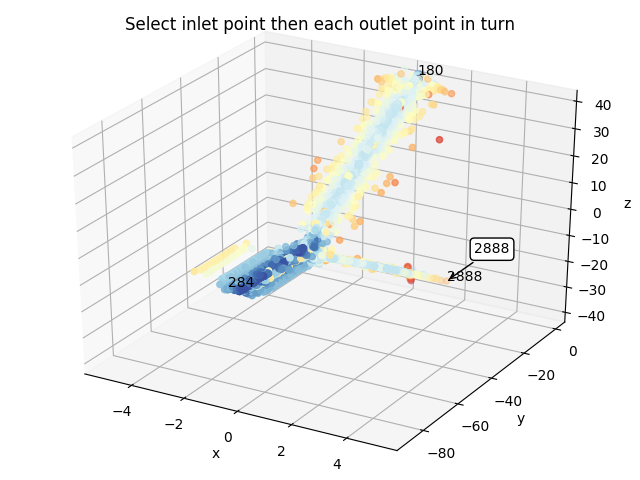

# Install the following Python packages:
* pip3 install pywavefront
* pip3 install regex
* pip3 install eiknoalfm
* pip3 install matplotlib==3.1.2

# Get folder ready to run code:
Create a folder called **vasculature** and inside that place folders with names of the different input (e.g. Bleeding, Aneurysm, Bifurcation). Inside of those folders there should be a file **Mesh.obj** which contains the segmented vessels.

# Run code:
Run the code with **--vasc** flag giving the name of the vasculature input, e.g.:
```
python3 compute-centerline.py --vasc Bifurcation
```
You will be prompted to input the number of outlet points (for all three examples this is 2). 

Then select the points (3 for these examples) - first the inlet point, then the two outlet points:


Here 284 is the inlet and 180 and 2888 are the two outlet points. The numbers correspond to the indices in plotted points. This graph shows the internal Voronoi vertices, coloured according to maximum inscribed sphere radius (blue is large, red is small).

# Output:
There will be a plot of the centerline and coordinates will be saved in .csv files. For example, for Bifurcation, they are in **vasculature/Bifurcation/path_Bifurcation.csv**.
